## 6.1 Lesson Plan - Intro to APIs and AJAX

### Overview

In this class, we will be introducing students to the concept of APIs and the use of AJAX calls to retrieve data from external data sources.

##### Instructor Priorities

* Students should be able to articulate a loose definition of API and JSON, along with a few examples of popular APIs
* Students should become more comfortable parsing JavaScript objects (both locally and as JSON)
* Students should complete the OMDb AJAX-to-HTML Activity  
* Instructor should walk through the Giphy API example

##### Instructor Notes

* Today's class is a fun one! Students will begin using AJAX to pull data from popular data sources. However, expect students to still have only a weak handle on JavaScript objects. Use the beginning of class to fill in any conceptual holes they may have. Spend the time necessary to get them feeling more confident breaking into a JavaScript object and retrieving specific fields.

* Before class, create an account at [Mashape](https://market.mashape.com/explore).

* Be sure to slack out this [tutorial on the OpenWeatherMap API](http://osp123.github.io/tutorials/html/weatherAPI.html) as pre-reading for this week's content.

* TAs should reference [6.1-TimeTracker](6.1-TimeTracker.xlsx) to help keep track of time during class.

- - -

### Class Objectives

* To introduce the concept and utility of APIs and JSON in web applications
* To be exposed to a variety of APIs and the process for building endpoint URLs to utilize them
* To work with the OMDb and Giphy APIs to build data-rich applications

- - -

### 1. Students Do: CustomerObject Parsing (5 mins)

* Welcome Students to class and let students know that we will begin with a warm-up activity.

* Slack out the following files and instructions.

* **Files**

  * [1-customer-object.html](Activities/01-CustomerObject/1-customer-object.html)

* **Instructions**

  * Using the instructions shown in the comments, create `console.log` statements that parse out the requested information.

  * Help those around you if you finish early.

### 2. Instructor Do: Review CustomerObject Parsing (5 mins)

* Either live-code the solution yourself or open the file [1-customer-object-solution.html](Activities/01-CustomerObject/1-customer-object-solution.html).

* While going over the solution, ask students why phoneNumber required an index parameter but first and last name did not.

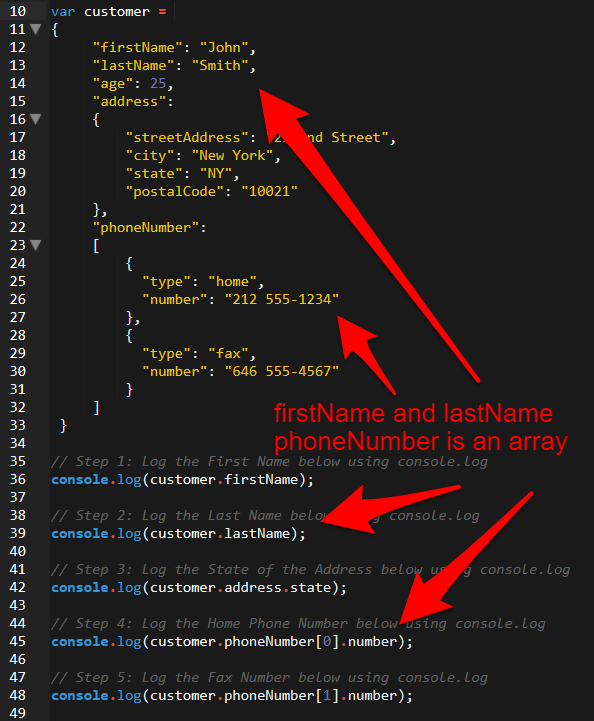

* Continue to ask questions to students to confirm their comfort with the material.   

* Then let students know that working with JavaScript Objects like this is incredibly important in web development as we will use them to transmit data repeatedly.

### 3. Students Do: Install JSON Formatter (5 mins)

* Next point students to the following link: [JSON Formatter](https://chrome.google.com/webstore/detail/json-formatter/bcjindcccaagfpapjjmafapmmgkkhgoa/related?hl=en) and have them install the Chrome extension.

* Let them know that this will format JSON in the browser.

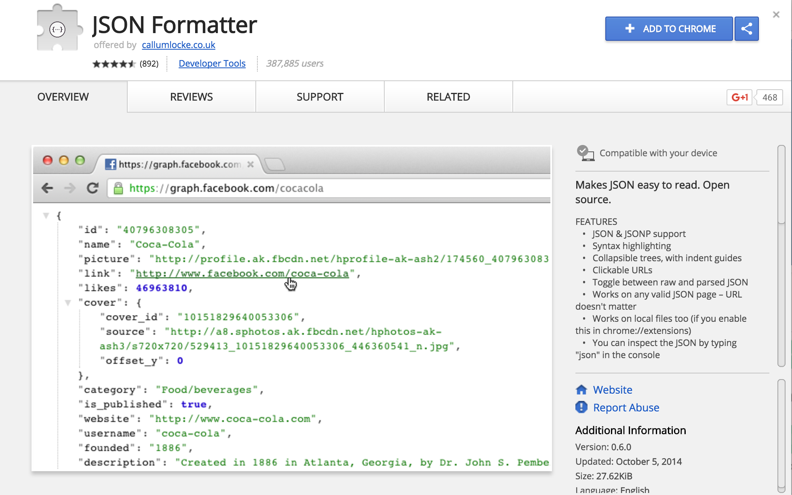

### 4. Instructor Do: MEAN Map Demo (10 mins)

* Next, go to the following link: [MEAN Map App](https://mean-google-maps.herokuapp.com).

* Briefly explain that the application's `Join the Team` provides an easy way for members to add themselves to a map. And that you can then use the `Find Teammates` panel to search for members that meet certain criteria. At this point, go ahead and add yourself somewhere to the map

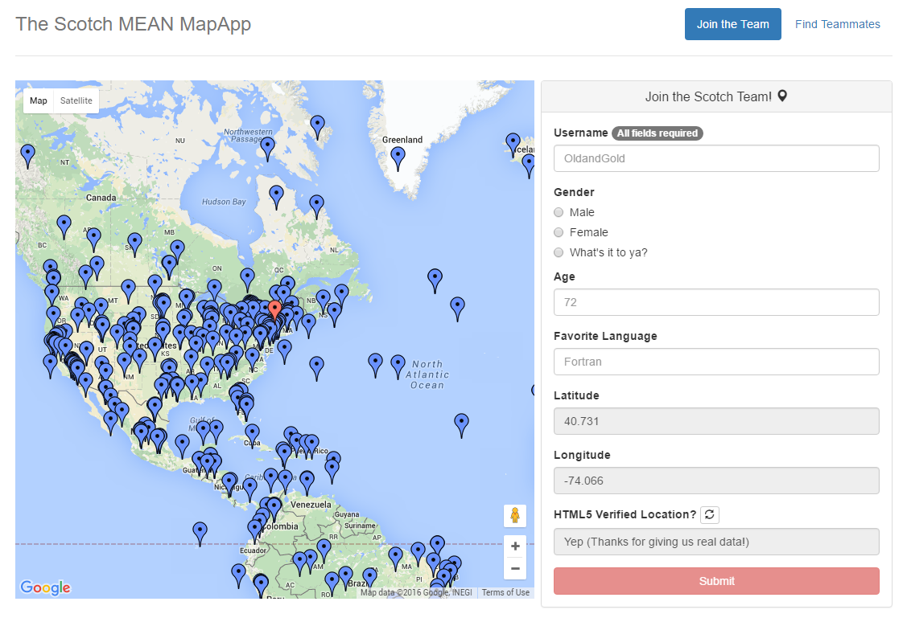

* Next, visit the following link: [MEAN Map API](https://mean-google-maps.herokuapp.com/users) to show students that "beneath the hood" the application is storing each user as an entry in a JavaScript Object. Just like with the CustomerObject example, this JavaScript is holding a mix of strings, numbers, and arrays to hold information like username, gender, age, and latitude/longitude.

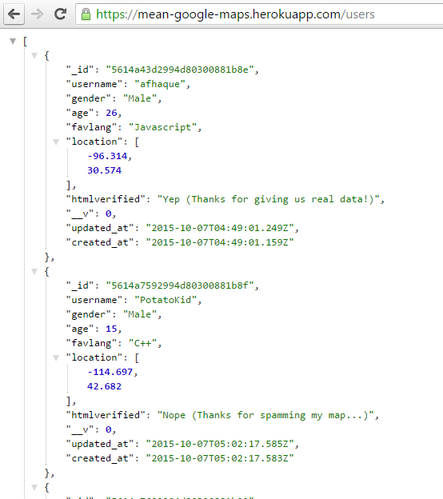

* Let them know that this approach of using JavaScript Objects as a data transmission method is an extremely common one.

* Then share both links to students.

### 5. Everyone Do: MEAN Map Review (5 mins)

* Give students a few moments to look at the map application and the users API endpoint.

* Encourage them to ask questions about this. If none are offered, have one or two students explain conceptually how the application works.

### 6. Students Do: API Research Questions (7 mins)

* Next slack out the following instructions to students:

* **Instructions:**

  * For the next few moments, research amongst yourselves the answers to the following questions:

    1. What is an API?
    2. What does API stand for?
    3. What are some examples of APIs? (Find links to specific APIs)
    4. What do these specific APIs allow you as a developer to do?

### 7. Everyone Do: Review API Research Questions (5 mins)

* Have students share their answers to these questions.

### 8. Instructor Do: API Definitions (6 mins)

* Then offer your own definition of an API. You can use the following if you like:

  > APIs stand for Application Programming Interfaces. They provide a way for creating user code that utilizes other pre-built code to do various tasks. It can be used to quickly retrieve data from another person's database, to utilize someone else's more complex functionality (like maps), or to control other hardware and software.

* Briefly talk about why APIs are created. Talk about how you save time not having to create your own code. Give a few examples of websites that use other companies' APIs.

  * AirBNB uses Google's API for maps [AirBNB](https://www.airbnb.com/s?s_tag=_s84SXqA)
  * Google Searches for Weather uses the Weather API [Weather Search](https://www.google.com/?gws_rd=ssl#q=weather+new+brunswick)
  * Even jQuery is an API [jQuery](https://jquery.com/)

* Point out that there are millions of APIs in existence.

* Point out that JSON (JavaScript Objects) are a common format for sending data between APIs. Use the word JSON so students hear/understand it.

* Encourage questions at this point!

* Don't worry if your explanations are pretty high-level at this point, in the next class you will re-explain the concepts in more detail.

### 9. Instructor Do: API Experimenting (10 mins)

* Navigate to this URL: [Yoda Speak](https://market.mashape.com/ismaelc/yoda-speak). Explain to students that the Yoda API will take a string sentence and then output a revised sentence.

* Then navigate to this URL: [Face Face++](http://www.faceplusplus.com/demo-detect/). Grab a photo of a student in your class who wears glasses via linkedIn or something and paste the image URL into the application. Explain that the response JSON is intended to analyze "sentiment" based on the image. Values closer too 100 are of greater likelihood  Have fun with the whole thing!

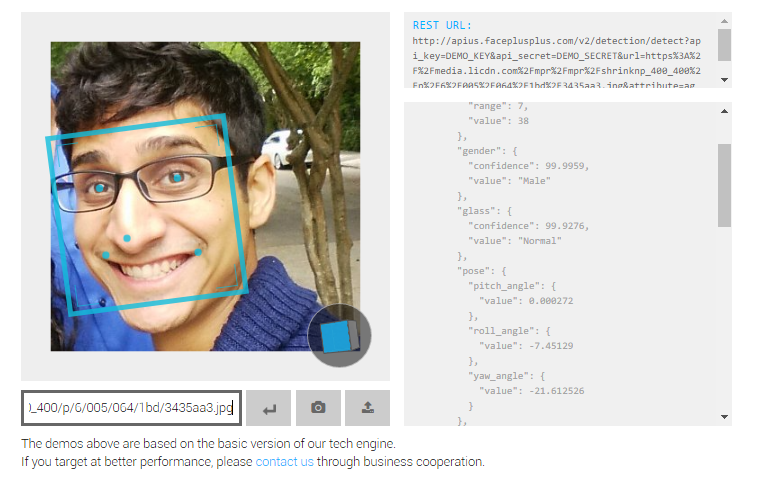

### 10. Students Do: API Experimenting (10 mins)

* Next have students experiment on their own with new APIs. Slack out the following instructions:

* **Instructions:**

  * Using the [Mashape API library](https://market.mashape.com/explore) as a starting point experiment with a few APIs of your own.

  * Note: You will need to create an account on Mashape first.

  * Note: Not all of the APIs are easy to use, just keep experimenting!  

### 11. Instructor Do: OMDb API Demo (5 mins)

* Present the following question. So if all this data exists in the world and we have JSON's being created, how do we access the data?

* Navigate to the [OMDb API](http://www.omdbapi.com/) and explain that this API provides a database of information on nearly every movie in existence.

* Scroll through the basic documentation and point out that in this API, we "build" URLs that point to JSONs associated with various movies. Point out that the parameters allow us to filter results.

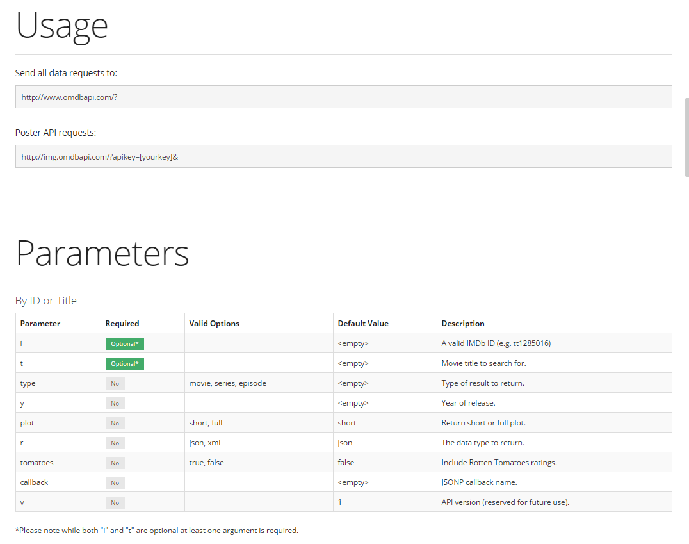

* Then use Example GUI to generate a URL for a movie of your choice.

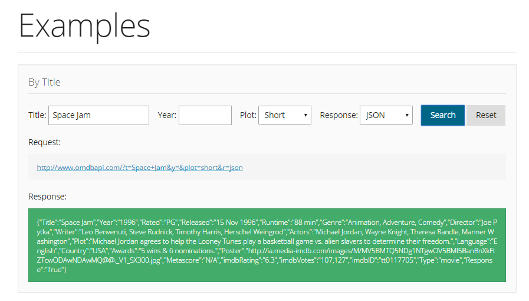

* Then visit the link that gets generated, and show students the JSON that was generated.

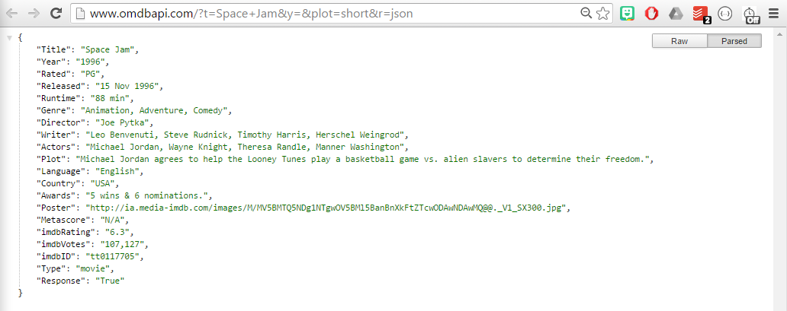

* Ask students if they have any questions.

### 12. Partners Do: OMDb API Exploration (10 mins)

* Have students explore the OMDb API themselves.

* Slack out the following instructions to students:

* **Instructions:**

  * Go to the [OMDb API](http://www.omdbapi.com/) then use the documentation to try to answer the following:

    * Without using the user interface, how would I query the OMDB API to get all of the information related to the movie: Frozen?

    * Hint: you will have to build a URL of your own with the search parameters listed.

### 13. Everyone Do: OMDb API URLs (10 mins)

* Using this <http://www.omdbapi.com/?t=Forrest+Gump&y=&plot=short&r=json> as an example, have students break down the URL.

* Be sure to have them explain each parameter listed (i.e. the `?t`, the `+`, the `&`, `r=`, etc).

* Then ask students how they would show multiple movies that meet a condition? (i.e. how would you get all movies with the word `Matrix` in it). SOLUTION: Use the `/s` format: <http://www.omdbapi.com/?s=Matrix&y=&plot=short&r=json>

- - -

### 14. BREAK (15 mins)

- - -

### 15. Instructor Do: AJAX Query Demo (10 mins)

* Now open up Sublime and create your own AJAX call to OMDb using the below code as an example. (Alternatively, you can use [single-ajax.html](Activities/02-Ajax_OMDB/single-ajax.html) in `02-Ajax_OMDB`). If making your own AJAX  call, however, be sure to include a few console logs after the AJAX call to demonstrate asynchronicity. See single-ajax.html for details.

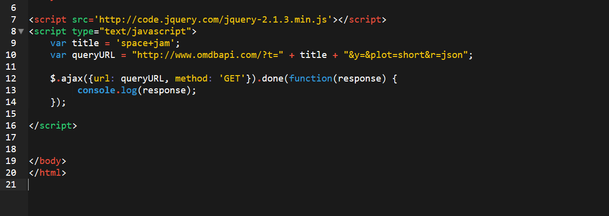

* Be sure to point out the various parts of the AJAX call:

  * The `queryURL` which points to the JSON
  * The `GET` method which tells JavaScript to download the JSON
  * The `done` function which tells JavaScript to run the code inside ONLY when done with the download
  * Most importantly that all of the data is being stored in the `response` object-2.9)
  * Lastly, in your Chrome inspector, point out how all the code past line 26 happens before the results of our API call are logged. Even though that happens first lexically. 

* Ask students why they think the `.done` function is necessary? Why does the code after the AJAX request happen before the API results are logged?

* After a minute or two of discussion, explain to students that JavaScript is synchronous in nature. Code is generally executed one line at a time. 

  * This makes the language easier to pick up initially, as code executes in the order one might expect.

  * But what if our API call takes a few seconds to come back? What if it takes a minute? Ten minutes? An hour?

  * While we won't be waiting on a request THAT long, it does pose a problem when we have other code that needs to run no matter what the API response is. Just waiting for the API call to complete in order to execute other unrelated code isn't very efficient and doesn't provide a good user experience. So JavaScript can BEHAVE asynchronous through the use of callback functions and promises.

  * We have already seen asynchronous behavior through callbacks with setTimeout and setInterval. We pass setTimeout and setInterval callback functions to execute whenever they're ready, WHENEVER that may be.

  * Promises are similar. The .done function is an example of a promise. This is essentially a function that "promises" to be executed at some point. In this case, whenever our data comes back from the API. We describe what we want to happen by passing a callback function as a parameter into our promise.

  * In short, because the AJAX request takes a certain amount of time, our code after AJAX call executes in the meantime. Remember, AJAX stands for ASYNCHRONOUS JavaScript and XML.

* Run the code and show the results in the console.

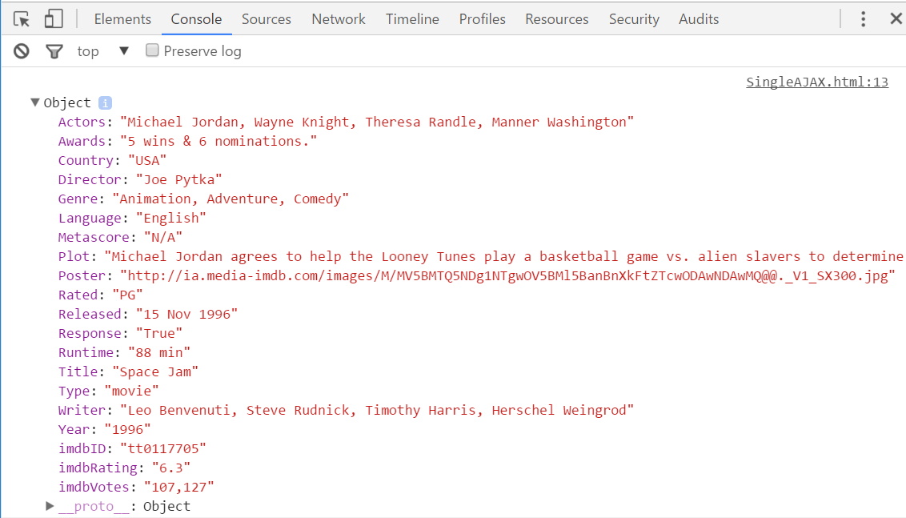

* Add a second AJAX call to another movie. (Alternatively you can use [multiple-ajax.html](Activities/02-Ajax_OMDB/multiple-ajax.html) in `02-Ajax_OMDB`).

* Open the floor to questions.

* Slack out the code you just created.

### 16. Everyone Do: Logging JSON (5 mins)

* Ask students how they might parse out and retrieve the movie's runtime or actors list in response? (Show the JSON on the side).

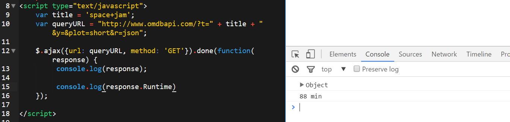

### 17. Students Do: AJAX Query Activity (15 mins)

* Slack out the following instructions to students:

  * **Instructions:**

  * Now it's your turn! Using the example AJAX code given to you, create an AJAX call to the OMDb API of your own.

  * Then try logging any property about the movie to your console.

### 18. Students Do: AJAX to HTML Activity (15 mins)

* Confirm that students were able to successfully log the JSON.

* Then open the file [3-ajax-to-html-solution.html](Activities/03-AJAX_to_HTML/3-ajax-to-html-solution.html) in your browser. Show students that, in this application, the web page has rendered the contents of the API into the HTML.

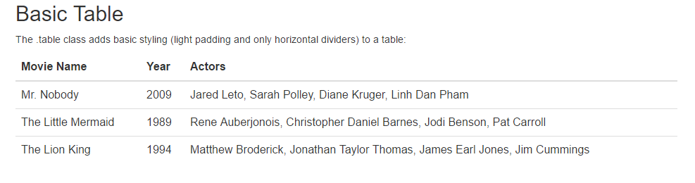

* Then slack out the following files and instructions to students.

* **File:**

  * [3-ajax-to-html.html](Activities/03-AJAX_to_HTML/3-ajax-to-html.html)

* **Instructions:**

  * Using [3-ajax-to-html.html](Activities/03-AJAX_to_HTML/3-ajax-to-html.html) as a starting point, fill up the HTML table with information about your own favorite movies.

  * HINT: You will need multiple AJAX Calls

  * BONUS: If you have time incorporate post images with your favorite movies. (Note: You won't have permission to access all images, but many will work. Keep experimenting!)

### 19. Instructor Do: Review AJAX to HTML Activity (7 mins)

* Review the solution to the previous activity ([3-ajax-to-html-solution](Activities/03-AJAX_to_HTML/3-ajax-to-html-solution.html)).

* Point out that we are able to use jQuery to paste the specific properties retrieved in the JSON directly into our HTML.

* Ask students why we put the code we want to execute after the AJAX call is complete inside the .done promise function?   

* Be sure to mention that because AJAX is asynchronous, this guarantees response is ready when we try and use it.

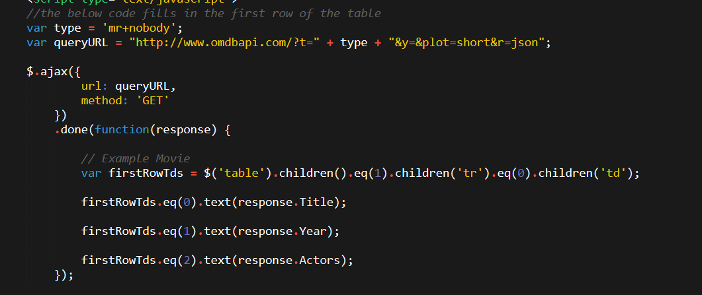

* Take any questions that may still exist on this activity.

### 20. Partners Do: Giphy Documentation (10 mins)

* Next point students to the [Giphy API Documentation](https://github.com/Giphy/GiphyAPI).

* Then slack out the following instructions:

* **Instructions:**

  * As partners, using the [Giphy API Documentation](https://github.com/Giphy/GiphyAPI), try to research answers to the following questions:

    * How would you return back a single gif tied to a search term?

    * How would you return five gifs tied to a search term?

    * How would you return the trending gifs back from this API?

* Let students know that their homework will use the Giphy API Documentation

### 21. Instructor Do: Giphy API Demo (10 mins)

* Finally, go over [19-giphy-api.html](Activities/04-Giphy_API/4-giphy-api.html). Point out the API key that needed to be appended to the end of your query URL.

* Slack out the [video review](https://www.youtube.com/watch?v=Kp7Xy2LScLM) for this activity.

### 22. Instructor Do: Homework Intro (5 mins)

* Go over the upcoming homework assignment. You can play the `homework_demo.mov` file or showcase the final solution file in the browser.

### 22. Students Do: Homework Intro (5 mins -- Optional)

* If any time remains, have students create their own AJAX calls to the Giphy API. Have them try to create a website with buttons that launch searches for Gifs associated with specific terms.  

- - -

### Copyright

Coding Boot Camp (C) 2015. All Rights Reserved.
